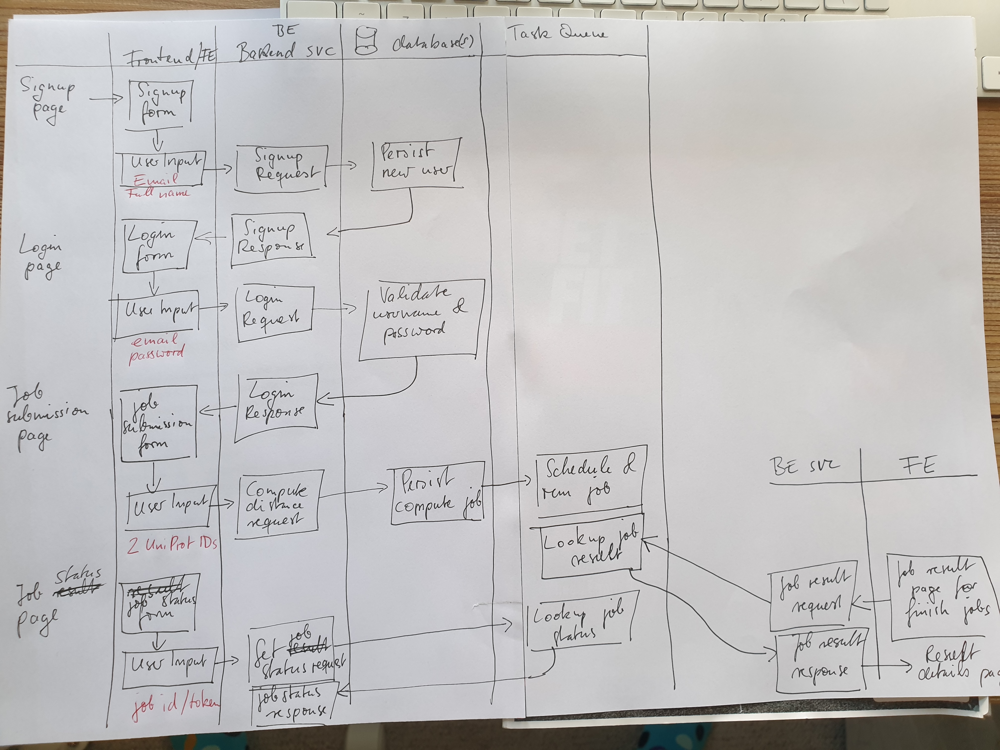
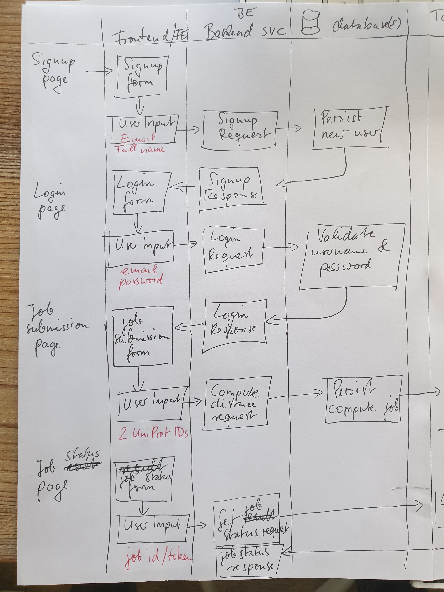
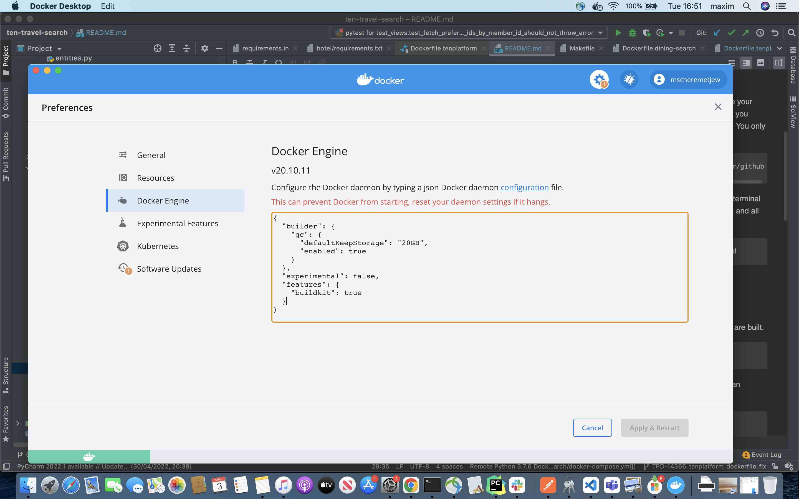

# levenshtein-distance-service 

## Table of content
1. [Introduction](#introduction)
2. [Architectural design](#architectural-design)
    1. [Graphical overview](#graphical-overview)
    2. [Frameworks and tools used](#frameworks-and-tools-used)      
3. [Development](#development)
    1. [Getting started](#getting-started)
    2. [How to enable BuildKit?](#how-to-enable-buildkit)   
       1. [Enable the BuildKit in Docker Desktop](#enable-the-buildkit-in-docker-desktop)
       2. [Enable the BuildKit in a fresh terminal](#enable-the-buildkit-in-a-fresh-terminal)
       3. [On Linux machines, you may also need](#on-linux-machines-you-may-also-need)
    3. [Building your Docker images](#building-your-docker-images)
    4. [How to access the web application?](#how-to-access-the-web-application)
    5. [How to update project dependencies?](#how-to-update-project-dependencies)
    6. [How to run services locally?](#how-to-run-services-locally)
    7. [How to access your local Postgres Docker service?](#how-to-access-your-local-postgres-docker-service)
4. [Testing and code formatting](#testing-and-code-formatting)
    1. [How to run tests locally?](#how-to-run-tests-locally)
    2. [How to format the code before pushing new changes to remote?](#how-to-format-the-code-before-pushing-new-changes-to-remote)
5. [Continuous integration/CI](#continuous-integration)
    1. [Code coverage](#code-coverage)


## Introduction

A web service for calculating the Levenshtein distance between two sequences.

In order to compare and study proteins, scientists have devised many computational techniques and
algorithms. One such algorithm is the “Levenshtein distance”, which computes the distance between
two string-like sequences. It is used as a simple measure of similarity between two proteins.

The aim of this project is to develop a web application where a user can compute the Levenshtein distance between
two proteins.

## Architectural design

### Graphical overview

Here is a graphical overview about the signup, login, job submission, job status check and job result retrieval flow:






### Frameworks and tools used

| Component      | Framework/Tool |
| ----------- | ----------- |
| Calculate Levenshtein distance      | [Levenshtein module](https://pypi.org/project/Levenshtein/)       |
| Protein sequence retrieval   | [UniProt REST API](https://www.uniprot.org/help/api)        |
| Web framework   | [Django](https://docs.djangoproject.com/en/4.2/intro/install/)        |
| Django backend database   | Any relation database would do the trick, e.g. PostgresSQL or MySQL        |
| User management system   | [Django auth app](https://docs.djangoproject.com/en/4.0/topics/auth/)        |
| Task Queue   | [Celery](https://docs.celeryq.dev/en/stable/getting-started/introduction.html)        |
| Task Queue Broker   | [Redis](https://docs.celeryq.dev/en/stable/getting-started/backends-and-brokers/redis.html#broker-redis)        |
| Task Queue Result Store   | Re-use Django backend database - Django ORM       |

## Development

### Getting started

Before you start make sure you have your private SSH Key added, which gives you access to certain GitHub organisation or private repos. You only have to do this once!

```shell
ssh-add /your/ssh/key/file/for/github
```

Every time you open a new console/terminal make sure your ssh-agent is running and all SSH keys are added.

```shell
eval `ssh-agent -s` && ssh-add
```

### How to enable BuildKit?

This could be achieved in different ways.

#### Enable the BuildKit in Docker Desktop



#### Enable the BuildKit in a fresh terminal

```
export DOCKER_BUILDKIT=1
```

##### On Linux machines, you may also need:
```
export COMPOSE_DOCKER_CLI_BUILD=1
```

### Building your Docker images

```shell
make build-service

docker-compose build

make migrate

make createsuperuser
```

And then the service can be started as following:

```shell
docker-compose up web
```

### How to access the web application?

Now that the web server is running, visit [http://127.0.0.1:8080/](http://127.0.0.1:8080/) with your web browser.

The login page can be accessed [here](http://127.0.0.1:8080/user-accounts/login/)

The registration page can be accessed [here](http://127.0.0.1:8080/user-accounts/register/)

### How to update project dependencies?

For this project we are using pip-tools to manage all project dependencies. Apply changes to
requirements.in and run pip-compile, which generates an updated version of requirements.txt.

For rsa keys run...
```console
make pip-compile-rsa
```

For ed-25519 keys run...
```console
make pip-compile-ed-25519
```

### How to run services locally?

#### How to start all services defined in docker-compose file - for development only?

```shell
docker-compose up
```

OR use the following Makefile command:
```shell
make up
```

#### How to start services marked with specific profiles - for development only?

Certain services are marked with specific profiles. To start these services
you have to use the --profile option in your docker-compose command.

```shell
docker-compose [--profile prometheus]  up
```

### How to access your local Postgres Docker service?

Execute the postgres docker container to enter the terminal. You can do that for instance via Docker Desktop.

```shell
docker exec -it <container_name> /bin/sh
```

Connect to the Postgres database terminal:
```shell
psql -d <db-name> -U <username> -W
```

DB and user name as well as the password can be found and changed in the docker-compose file (see env var POSTGRES_DB etc.)
```shell
psql -d distance_service -U maxim -W
```

## Testing and code formatting

### How to run tests locally?

```console
make pytest

OR you can run specific test like this...
docker-compose run --rm --entrypoint=sh <service-name> -c "pytest app/tests/unit/test_*.py"
```

### How to format the code before pushing new changes to remote?

```console
make format

make lint
```

## Continuous integration

...

### Code coverage

For this project code coverage is set up.